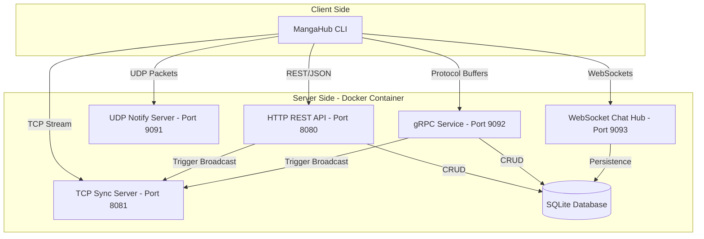

# MangaHub - Architectural Overview

This document provides a high-level technical overview of the MangaHub system architecture, communication protocols, and data flow.

## 1. High-Level Architecture

MangaHub is designed as a **Multi-Protocol Distributed System**. It consists of a central **Server** (hosting multiple services) and a **Command Line Interface (CLI)** that acts as the primary client.

---

## 2. Communication Protocols & Responsibilities

The system utilizes five distinct protocols to handle different types of interaction:

| Protocol | Purpose | Key Functionality |
|----------|---------|-------------------|
| **HTTP (REST)** | Management & CRUD | User Auth, Manga Search, Library management. |
| **TCP** | State Synchronization | Real-time broadcast of reading progress across devices. |
| **UDP** | Instant Notifications | Low-latency pub/sub for new chapter release alerts. |
| **gRPC** | High-speed Internal | Efficient manga querying and progress updates via Protobuf. |
| **WebSocket** | Real-time Interaction | Bi-directional multi-room chat system and private messaging. |

---

## 3. Data Flow Scenarios

### 3.1 Progress Synchronization Flow
1. **Client A** updates reading progress via **HTTP PUT** or **gRPC**.
2. **Server** saves the new state to **SQLite**.
3. **Server** sends a broadcast message to the **TCP Sync Server**.
4. **TCP Sync Server** pushes the update to all connected clients (including **Client B**) in real-time.

### 3.2 Notification Pub/Sub Flow
1. **Client** registers its IP/Port via **UDP Registration** packet.
2. **Admin/System** triggers a "New Chapter" event.
3. **UDP Server** iterates through the subscriber list and sends non-blocking UDP datagrams to all active clients.

---

## 4. Software Stack

- **Language**: [Go (Golang)](https://go.dev/) - Chosen for high concurrency support (Goroutines) and excellent networking primitives.
- **Database**: [SQLite](https://sqlite.org/) - A lightweight, file-based SQL engine perfect for portable projects.
- **Deployment**: [Docker](https://www.docker.com/) - Ensures environment consistency for all 5 protocol servers.
- **Frameworks**:
  - `Gin Gonic` for HTTP Routing.
  - `Gorilla WebSocket` for Real-time chat.
  - `gRPC-Go` for internal services.

---

## 5. Internal Component Breakdown

- **`internal/auth/`**: Handles JWT generation, password hashing (bcrypt), and session validation.
- **`internal/manga/`**: Core logic for searching, filtering, and managing manga metadata.
- **`internal/sync/`**: Manages the TCP connection pool and broadcast logic.
- **`internal/chat/`**: Implements the WebSocket Hub, room management, and private message routing.
- **`pkg/database/`**: Thread-safe SQLite initialization with WAL (Write-Ahead Logging) mode.

---

## 6. Security Considerations

- **JWT Authentication**: All sensitive operations (Library, Progress, Chat) require a valid JSON Web Token.
- **Password Hashing**: Passwords are never stored in plain text.
- **Session Isolation**: CLI uses local session files to manage multiple concurrent user tokens safely.
